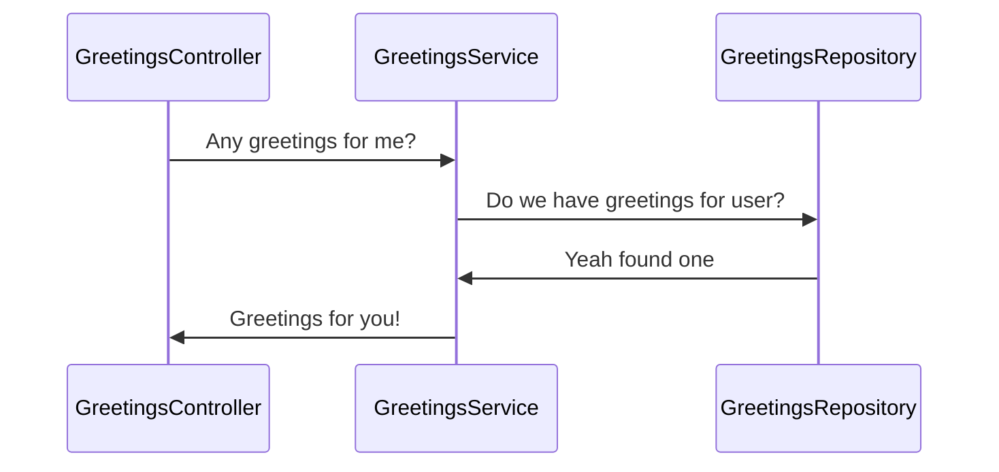

  
# TDD with Micronaut, Kotlin and mockk!

Hi! This is my first article and I'm very excited about your feedback. I hope you will find some information you were looking for and may be learn something while reading through.


# Micronaut

I will skip the marketing description of Micronaut, because you can easily go to [docs.micronaut.io](https://docs.micronaut.io/) and read through the documentation (which is really useful). 
However I want to tell you my reason why I've started using micronaut as my goto framework for kotlin based web service development:
1) It stars very fast
2) It looks like Spring
3) Requires less memory than spring
4) Smaller *stack trace* (you can actually read the sources and easily figure out how it works)
5) compile time checks for data-jpa repo validity
6) Its something new 😇

## TDD

First of all: (imho), you only know a language/framework if you are able to write tests for it. In this article I want to show you how to write tests - and fix them - for your controllers and services using ***Kotlin***, ***MockK*** and ***Junit-5***.
But first:

## Lets get started
### what you need:
- gradle installed
- (tested with) openjdk 11 or (not tested by me) jdk8
- [enable annotation processing]([https://immutables.github.io/apt.html](https://immutables.github.io/apt.html))
- Make sure you use the [gradle test runner]([https://www.jetbrains.com/help/idea/work-with-tests-in-gradle.html](https://www.jetbrains.com/help/idea/work-with-tests-in-gradle.html))
- clone of my repository with the starter project: [micronaut-example.git](https://github.com/jaecktec/micronaut-example.git)

#### Micronaut-Example repo contents
you will find a project with a main class, the basic boilerplate for micronaut and kotlin and one test that checks if the context loads correctly

#### build.gradle.kts
The most interesting file currently is the buildfile itself. Here we will find some differences to Spring (apart from the dependencies of course)

AllOpen adds `open` to all Classes annotated with `@Around` and `@Controller`. This is needed for the `@Valid` capability
```
allOpen {
	annotations(
            "io.micronaut.aop.Around",
            "io.micronaut.http.annotation.Controller"
    )
}
```

this will set the jvm Target to 1.8 and enable strict null checking while compiling. This saved me already from having strange effects while executing the code. 
```
tasks.withType<KotlinCompile> {  
  kotlinOptions {  
  freeCompilerArgs = listOf("-Xjsr305=strict")  
        jvmTarget = "1.8"  
  }  
}
```


#### Dependencies
- Required dependencies for kotlin/reflections and jdk8
- Those are the micronaut core and http dependencies
- logback and jackson kotlin module are only required as runtime dependencies
- micronaut-validation is a lightweight implementation of the Java validation spec
- kotlin test annotations
- mocking(mockk) and junit dependencies

and at last: 
```
val test by tasks.getting(Test::class) {
    useJUnitPlatform { }
}
```
here we tell gradle to use junit5 to run our tests in the test task. 

### Planning out what we are going to do:

We will implement a typical backend architecture pattern (Controller -> Service -> Repository) like in the diagram:



### Creating our first test:

Let's start with the most difficult part in today's journey writing the controller test.
First we will create a new class in our test scope and annotate it with `@MicronautTest`. This will spin up the Micronaut Server and context for `dependency injection` for our test.

```
import io.micronaut.test.annotation.MicronautTest  
  
@MicronautTest  
class GreetingsControllerTest {  
}
```

Micronaut gives us a handy tool, which we can use for our tests, the [Declarative Clients]([https://docs.micronaut.io/latest/guide/index.html#clientAnnotation](https://docs.micronaut.io/latest/guide/index.html#clientAnnotation))
with only a few lines of code we can define how we want to interface with our Controller:

```
@Client("/greetings")  
interface GreetingsControllerTestClient{  
    @Get  
    fun getGreetings(): HttpResponse<Greetings>  
    data class Greetings(val greetings: List<String>)  
}
```

This test-controller can now be `@javax.inject.Inject`ed into our test.

```
@Inject 
lateinit var client: GreetingsControllerTestClient
```

#### Expectation
For our first expectation we just want to greet "Bob" so let's actually write our test:

```
@MicronautTest  
class GreetingsControllerTest {  
	@Inject
	lateinit var client: GreetingsControllerTestClient  
	@Test  
	fun `should return greetings`() {  
		// given
		// when  
		val response = client.getGreetings()  
		// then  
		assertEquals(HttpStatus.OK, response.status())  
		assertEquals(listOf("Hey Coco"), response.body()!!.greetings)
	}  
}
```

And 🏃‍♀️it:
```
23:05:04.384 [Test worker] INFO  i.m.context.env.DefaultEnvironment - Established active environments: [test]

java.lang.NullPointerException
	at com.micronaut.example.controller.GreetingsControllerTest.should return greetings(GreetingsControllerTest.kt:35)
	at java.base/jdk.internal.reflect.NativeMethodAccessorImpl.invoke0(Native Method)
	at java.base/jdk.internal.reflect.NativeMethodAccessorImpl.invoke(NativeMethodAccessorImpl.java:62)
	at java.base/jdk.internal.reflect.DelegatingMethodAccessorImpl.invoke(DelegatingMethodAccessorImpl.java:43)
	at java.base/java.lang.reflect.Method.invoke(Method.java:566)
	...
at org.gradle.internal.concurrent.ThreadFactoryImpl$ManagedThreadRunnable.run(ThreadFactoryImpl.java:56)
	at java.base/java.lang.Thread.run(Thread.java:834)

com.micronaut.example.controller.GreetingsControllerTest > should return greetings() FAILED
    java.lang.NullPointerException at GreetingsControllerTest.kt:35
1 test completed, 1 failed
> Task :test FAILED
```

**Okay** we wanted that our tests fails, but why is this now a `NPE`?
[Somewhere]([https://github.com/micronaut-projects/micronaut-core/issues/1188](https://github.com/micronaut-projects/micronaut-core/issues/1188)) is written, that micronaut will return `null` for blocking declarative clients 🤨.
In case you still want to get access to the response, the client is not dumping it, you can use the `HttpResponse#getResponse#getBody(T::class)` to map it. 

#### The 🎮

The Skeleton will look similar to this:

```
@Controller("/greetings")  
class GreetingsController {  
    @Get  
    fun getGreetings() {  
        TODO()  
    }  
}
```

_in case someone is curious, rerunning the test now, should result in a 500 Server Error which leads to a `HttpClientResponseException`_

**Micronaut encurages everyone to code with the reactive pattern in mind, but we won't do that in this article - sorry 🙏**

### Making the test green
Like in spring we just need to return a PoJo and Jackson will take care of the serialisation

```
@Controller("/greetings")  
class GreetingsController {  
    @Get  
    fun getGreetings(): GreetingsResponse {  
        return GreetingsResponse(listOf("Hey Coco"))  
    }   
    data class GreetingsRse(val greetings: List<String>)  
}
```

### The Service

#### Let's start by creating the service and its test:

```
@MicronautTest  
class GreetingsServiceTest { @Injectteinit var subject: GreetingsService
}
```

```
@Singleton  
class GreetingsService{
}
```

The `@Singleton` annotation tells the Micronaut framework to create a singleton instance of your class and makes it available for depencency `@Inject`ion

with that setup lets create our `getGreetings([string] username)` function
Test:
```
@Test 
fun `should return greetings for user`() {  
	// given
	val username = "Coco"    
	// when
	val greetings = subject.getGreetings(username)  
	// then 
	assertEquals(listOf("Hallo Coco"), greetings)  
}
```

```
fun getGreetings(username: String) : List<String>{  
    return listOf("Hallo Coco")  
}
```

but this is kinda boring, so lets create a repository definition and mock it

Repository: 
```
@Singleton  
class GreetingsRepository {    

fun findGreetingsForUser(username: String): List<String> {  
     TODO("not implemented")
  }  
}
```

Test: 
``` 
@MicronautTest  
class GreetingsServiceTest {  
	@Inject  
	lateinit var subject: GreetingsService  
	@get:MockBean(GreetingsRepository::class)
	val greetingsRepository = mockk<GreetingsRepository>()  
	@Test  
	fun `should return greetings for user`() {  
		// given  
		val username = "Bob"  
		val expectedGreetings = listOf("Hallo Bob")  
		every { greetingsRepository.findGreetingsForUser(username) } returns expectedGreetings  
		// when  
		val greetings = subject.getGreetings(username)  
		// then  
		assertEquals(expectedGreetings, greetings)  
	}  
}
```
now execute your test to make sure it fails correctly. However those two log lines tell you, that there was a problem while compiling:
```
> Task :kaptTestKotlin FAILED
e: error: Cannot apply AOP advice to final class. Class must be made non-final to support proxying: com.micronaut.example.repository.GreetingsRepository
```
#### Understanding the problem:
`mockk` uses [proxying]([https://docs.oracle.com/javase/8/docs/technotes/guides/reflection/proxy.html](https://docs.oracle.com/javase/8/docs/technotes/guides/reflection/proxy.html)). However extending a final class is not possible in java so you have two options:
add an `open` keyword (uncool)
adjust the gradle allopen plugin (thats the one we're going with):

in your `gradle.properties.kts` file, go to `allOpen` and add the `@Singleton` annotation: 
```
allOpen {  
  annotations(  
  "io.micronaut.aop.Around",  
  "io.micronaut.http.annotation.Controller",  
  "javax.inject.Singleton"  
  )  
}
```
now, we've told the `allOpen` plugin to add an `open` to all classes (and methods within) to add the `open` modifier.
run it again and we get the proper assertion error `AssertionFailedError: expected: <[Hallo Bob]> but was: <[Hallo Coco]>`

Micronaut supports constructor injection, so we can simply add our repository in the constructor and implement our method: 

```
@Singleton  
class GreetingsService(private val greetingsRepository: GreetingsRepository){  
    fun getGreetings(username: String) : List<String>{        
		return greetingsRepository.findGreetingsForUser(username)  
    }  
}
```

run our test and:
```
no answer found for: GreetingsRepository(#1).findGreetingsForUser(Bob)
```
🤨 it looks like our mocks are not applied?

lets go back at our test and look at how we've set up our test:
```
@get:MockBean(GreetingsRepository::class) 
var greetingsRepository: GreetingsRepository = mockk()
[...]
	every { greetingsRepository.findGreetingsForUser(username) } returns expectedGreetings
```
there is a small pitfall in mockk and Micronaut. The fact that Micronaut binds your dependency with [AOP]([https://en.wikipedia.org/wiki/Aspect-oriented_programming](https://en.wikipedia.org/wiki/Aspect-oriented_programming)) it requires that the mock is already created before the test starts. For that we've told micronaut where to find our mock with the `@get:MockBean` annotation (the `MockBean` is a *method* target Annotation and can not be used on *fields*). 
When we attach logs to our *get*  function, we'll get insights about why our test is not working: 

```
@get:MockBean(GreetingsRepository::class)  
val greetingsRepository: GreetingsRepository  
	get() {  
		log.info { "Get GreetingsRepository Mock" }  
		return mockk()  
	}
```

```
Nov 24, 2019 8:20:59 PM com.micronaut.example.service.GreetingsServiceTest getGreetingsRepository
INFO: Get GreetingsRepository Mock
Nov 24, 2019 8:21:00 PM com.micronaut.example.service.GreetingsServiceTest getGreetingsRepository
INFO: Get GreetingsRepository Mock
```

Conclusion: The object where we add our mocks is not the object which is passed to the framework!

There are two solutions out there (based on my knowledge): 
1. Make sure you always return the same instance of the mock
2. Get the mock instance from the framework via `@Inject`

my personal favourite is Nr.1 however lets go with version Nr.2 just for the lesser amount of code required:

```
@MockBean(GreetingsRepository::class)  
fun greetingsRepositoryMock(): GreetingsRepository = mockk()  
@Inject  
lateinit var greetingsRepository: GreetingsRepository
```

Once you've rerun your tests, all tests should be green.

### The Repository
The plan is to use hibernate with an h2 database.

#### Dependencies
First, add *hibernate-jpa*, *hikari* as dependencies and *h2* as runtime dependency
*val micronautDataHibernateJpaVersion = "1.0.0.M5"*
```
kapt("io.micronaut.data:micronaut-data-processor:$micronautDataHibernateJpaVersion")  implementation("io.micronaut.data:micronaut-data-hibernate-jpa:$micronautDataHibernateJpaVersion")
implementation("io.micronaut.data:micronaut-data-hibernate-jpa:$micronautDataHibernateJpaVersion")
implementation("io.micronaut.configuration:micronaut-jdbc-hikari")  
runtime("com.h2database:h2")
```

#### application configuration

***This part was written based of the M5 docs***

A more complete tutorial can be found in the [micronaut-data](https://micronaut-projects.github.io/micronaut-data/latest/guide/](https://micronaut-projects.github.io/micronaut-data/latest/guide/)) docs
Now we need to tell Micronaut how to configure your driver:
```
datasources:  
  default:
	url: jdbc:h2:mem:default;DB_CLOSE_DELAY=-1;DB_CLOSE_ON_EXIT=FALSE
    username: sa
    password: ""
    driverClassName: org.h2.Driver
```
```
jpa:
	default:  
		entity-scan:  
		      packages:  
		        - 'com.micronaut.example.domain'  
		        - 'com.micronaut.example.repository'  
			properties:  
			   hibernate:  
				   hbm2ddl:  
			          auto: update  
			       show_sql: true
```

this tells micronaut to use **in-memory with h2** as well as that our Entity classes repository are located in `com.micronaut.example.domain`.
Additionally we're telling hibernate to auto-update our tables and for intel-sake, were logging the executed sql

#### the entity
With the previous step set up our database, now we can create our entity:

```
import javax.persistence.*
  
@Entity  
data class Greeting(  
	@Id  
	@GeneratedValue  var id: Long,  
	var username: String,  
	var greeting: String  
)
```

note that all annotations are from the `javax.persistence` package.

#### the repository
now lets update our repository, to be an **interface** annotated with`@Repository` (spring-data style)

```
@Repository  
interface GreetingsRepository: CrudRepository<Greeting, Long> {  
    fun findGreetingsForUser(username: String): List<String>  
}
```

In case you are curious and execute your *GreetingsServiceTest* you will receive an error message simmilar to this:
`error: Unable to implement Repository method: GreetingsRepository.findGreetingsForUser(String username). Cannot project on non-existent property: greetingsForUser`
You've just witnessed compile-time jpa verification. 😱
The naming convention follows the following pattern:


thus the correct function definition should look like this: `fun findByUsername(username: String): List<Greeting>`

this however ends up in some compilation errors, so lets quickly fix our GreetingsService by adjusting the return types and changing the mocks in the test:
```
@Test fun `should greetings for user`() {  
	// given
	val username = "Bob"  
	val expectedGreetings = listOf("Hallo Bob")  
	every { greetingsRepository.findByUsername(username) } returns expectedGreetings.mapIndexed { index, s -> Greeting(index.toLong(), username, s) }  
	// when   
	val greetings = subject.getGreetings(username)  
	// then   
	assertEquals(expectedGreetings, greetings)  
}
```
Fix the actual service by adding a mapping function: 
```
fun getGreetings(username: String) : List<String>{ 
	return greetingsRepository.findByUsername(username).map { it.greeting }  
}
```

#### don't mock what you don't own
I for myself don't like to write tests for implementations of other people as well as I don't like to mock away those things (sometimes it's not possible to avoid it, however this is another story)

So lets change our test, to actually use the h2 database by inserting to the database instead of mocking
```
@MicronautTest  
class GreetingsServiceTest {  
	@Inject  
	lateinit var greetingsRepository: GreetingsRepository  
	 
	@Inject  
	lateinit var subject: GreetingsService  

	@BeforeEach  fun setUp() {
	  	greetingsRepository.deleteAll()
	}  

	@Test  
	fun `should return greetings for user`() {  
		// given  
		val username = "Bob"  
		val expectedGreetings = listOf("Hallo Bob")  
		greetingsRepository.saveAll(expectedGreetings.map { s -> Greeting(null, username, s) })  

		// when  
		val greetings = subject.getGreetings(username)  
		// then  
		assertEquals(expectedGreetings, greetings)  
	}  
}
```
We've removed the mocking of the repository, and now are using the saveAll instead of mocking. 
Additionally we're cleaning the database before each test, to make sure our tests are stateless.

### Use the Service in the Controller
The last step for this part of the tutorial, lets use the service in the controller (with proper test ofc.)

Lets apply what we have learned:
1. prepare the mock
2. mock our data
and add one more new thing:
`verify` our call to the service

```
@MicronautTest  
class GreetingsControllerTest {  
    @MockBean(GreetingsService::class)  
    fun greetingsService(): GreetingsService = mockk()  
	@Inject 
	lateinit var client: GreetingsControllerTestClient  
	@Inject  
    lateinit var greetingsService: GreetingsService  
  
  @Test  
  fun `should return greetings`() {  
    // given	  
	every { greetingsService.getGreetings(any()) } returns listOf("Hey Bob")  
	// when  
	val response = client.getGreetings()  
	// then 
	assertEquals(HttpStatus.OK, response.status())  
	assertEquals(listOf("Hey Bob"), response.body()!!.greetings)     
	verify { greetingsService.getGreetings("Bob") }
  }
}

```

 his is a small **best practice**: *Create your data mocks as generic as possible, so your mock always returns something for any input, then verify that your mock got called with the proper arguments.
This helps in your test feedback - imagine your code is correct, however your input is wrong. Restrictive mocks will return nothing or fail differently, this will probably give you an exception and no assertion fail.*

in `every { greetingsService.getGreetings(any()) } returns listOf("Hey Bob")` we'll make sure our greetings service returns our greetings for *Bob*. In `verify { greetingsService.getGreetings("Bob") }` we'll make sure, we've actually fetched greetings for *Bob*.

Lets **run the test** >> `Verification failed: call 1 of 1: GreetingsService(#1).getGreetings(eq(Bob))) was not called` 
tells us, that we haven't called our service correctly, so let's implement that as well:
```
@Controller("/greetings")  
class GreetingsController(private val greetingsService: GreetingsService) {  
  @Get  
  fun getGreetings(): GreetingsResponse {  
        return greetingsService.getGreetings("Bob").run { GreetingsResponse(this) }  
  }  
  data class GreetingsResponse(val greetings: List<String>)  
}
```


## Yey done!
thanks for working through my first "How To".
Next up: (WIP) Security with Micronaut
